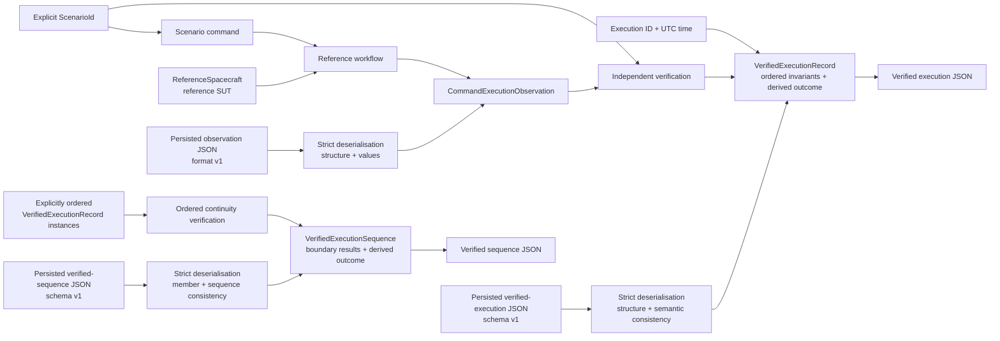

# OrbiRig

OrbiRig is a non-operational verification harness for simplified spacecraft operating-mode workflows. It collects command-execution observations and verifies them against explicit scenario expectations. The harness also checks continuity across ordered verified executions and represents observations, verified executions, and verified execution sequences as deterministic versioned JSON evidence.

Verification results remain reproducible and independently inspectable, including when persisted JSON evidence is reconstructed.

`ReferenceSpacecraft` is a deterministic, simplified spacecraft-behaviour test double used as the reference system under test (SUT). It provides repeatable behaviour for the supported scenarios but does not act as the verification oracle.

**Core:** Python

**Web interface:** FastAPI · React · TypeScript · Vite

**Testing and CI:** pytest · Behave · Vitest · React Testing Library · Ruff · GitHub Actions

## Key capabilities

* execute three deterministic reference operating-mode scenarios and collect the command, pre-state, acknowledgement, post-state, and telemetry;
* verify observations independently against an explicitly selected `ScenarioId` using ordered invariants;
* distinguish expected command rejection from failed verification;
* verify operating-mode continuity across explicitly ordered verified execution records;
* serialise observations, verified execution records, and verified execution sequences to deterministic versioned JSON;
* strictly reconstruct persisted observation evidence with structural and value validation, keeping evidence validity separate from verification success;
* strictly reconstruct persisted verified-execution and verified-execution-sequence evidence only when stored derived results agree with independently recomputed canonical verification results;
* inspect pasted observation, verified-execution, and verified-execution-sequence evidence through a read-only web interface while keeping evidence deserialisation and verification semantics in the OrbiRig core.

## Verification flow



Fresh observations are collected around one command execution. Persisted version `1` observation JSON reaches the same `CommandExecutionObservation` model through a separate strict deserialisation boundary. In either path, the caller supplies the scenario expectation; it is never inferred from the observation.

## Verification boundaries

`ReferenceSpacecraft` provides deterministic reference behaviour, while the verifier evaluates observations independently. Successful observation-evidence deserialisation establishes only supported structural and value validity; it does not establish verification success.

Observation evidence does not store, infer, derive, or select a `ScenarioId`. A structurally valid observation, including one with an accepted acknowledgement, can still fail verification. Conversely, an expected command rejection passes when its rejection and preserved state satisfy the selected scenario expectations. Tests also submit inconsistent observations directly to the verifier, so verification is not validated only against output from the reference SUT.

Persisted derived verification results are treated as claims rather than trusted as verification truth. When verified-execution evidence is deserialised, OrbiRig independently recomputes its canonical invariant results and outcome. For verified sequences, it also reconstructs each member canonically and recomputes continuity and the aggregate outcome in persisted order. Stored derived values must match these canonical results exactly. A canonically consistent `FAIL` record or sequence is therefore valid evidence; validity does not require a `PASS` outcome.

## Supported reference scenarios

| Scenario | Pre-state | Command | Expected acknowledgement | Expected post-state |
| --- | --- | --- | --- | --- |
| `NOMINAL_TO_SAFE_MODE` | `NOMINAL` | `SET_OPERATING_MODE(SAFE)` | accepted | `SAFE` |
| `NOMINAL_TO_NOMINAL_REJECTION` | `NOMINAL` | `SET_OPERATING_MODE(NOMINAL)` | rejected | `NOMINAL` |
| `SAFE_TO_NOMINAL_MODE` | `SAFE` | `SET_OPERATING_MODE(NOMINAL)` | accepted | `NOMINAL` |

For accepted transitions, verification checks the expected pre-state, accepted acknowledgement, requested post-state, and telemetry consistency with the observed post-state. For the expected rejection, it checks the expected `NOMINAL` pre-state, rejected acknowledgement, state preservation, and telemetry consistency with the observed post-state.

## Ordered execution continuity

Ordered continuity verification exposes cross-execution state discontinuities that individual verified execution records cannot detect.

`verify_execution_sequence(...)` evaluates an explicitly ordered collection of at least two existing `VerifiedExecutionRecord` instances. For every adjacent pair, it compares the previous post-state operating mode with the next pre-state operating mode and retains both execution IDs, the expected and observed modes, and the boundary result.

Supplied order is authoritative: the verifier does not sort or infer order from timestamps, execution IDs, or scenarios. A sequence passes only when every member record already passes and every continuity boundary passes; member scenario invariants are not re-evaluated. The verifier is pure: it neither executes commands nor mutates a SUT.

## Execution evidence

OrbiRig has three serialised evidence representations.

### Observation evidence

Observation evidence records the command, pre-command state, acknowledgement, post-command state, and telemetry from one execution. `serialize_execution_evidence(...)` writes deterministic JSON using observation evidence format version `1`; `deserialize_execution_evidence(...)` strictly reconstructs a `CommandExecutionObservation` and rejects malformed JSON, duplicate object member names at any nesting level, unsupported versions, invalid shapes, missing or unexpected fields, incorrect primitive types, unknown modes, and unsupported command types.

Observation evidence contains neither `ScenarioId`, invariant results, nor a verification outcome. Its successful deserialisation therefore does not attest semantic verification.

### Verified execution records

`VerifiedExecutionRecord` combines an explicit execution ID, UTC execution time, selected `ScenarioId`, observation, ordered invariant results with expected and actual values, and a derived outcome. It passes only when every invariant passes.

`serialize_verified_execution_evidence(...)` writes deterministic JSON using verified-execution schema version `1`. `deserialize_verified_execution_evidence(...)` strictly reconstructs a record by independently deriving its canonical invariant results and outcome from the persisted scenario and observation, then requiring the stored derived values to match exactly. A canonically consistent `FAIL` record remains valid evidence. Package versions and evidence/schema versions are independent version domains; one does not imply a change to the other.

### Verified execution sequences

`serialize_verified_execution_sequence_evidence(...)` writes an ordered `VerifiedExecutionSequence` using verified-execution-sequence schema version `1`. Each member is stored as complete nested verified-execution data, followed by every ordered continuity result and the aggregate outcome.

`deserialize_verified_execution_sequence_evidence(...)` strictly reconstructs each member through the verified-execution evidence semantics, then recomputes continuity in persisted order. Persisted boundaries and the aggregate outcome must exactly match the canonical sequence result. Duplicate execution IDs and equal or non-monotonic timestamps remain valid; neither determines sequence order.

## Usage

### Execute and verify a reference workflow

```python
from datetime import datetime, timezone

from orbirig.evidence import serialize_verified_execution_evidence
from orbirig.execution import execute_verified_reference_workflow
from orbirig.models import ScenarioId
from orbirig.reference_sut import ReferenceSpacecraft

record = execute_verified_reference_workflow(
    spacecraft=ReferenceSpacecraft(),
    execution_id="example-001",
    executed_at=datetime(2026, 1, 1, tzinfo=timezone.utc),
    scenario_id=ScenarioId.NOMINAL_TO_SAFE_MODE,
)

print(serialize_verified_execution_evidence(record))
```

### Verify loaded observation evidence

```python
from datetime import datetime, timezone
from pathlib import Path

from orbirig.evidence import deserialize_execution_evidence
from orbirig.execution import build_verified_execution_record
from orbirig.models import ScenarioId

observation = deserialize_execution_evidence(
    Path("observation.json").read_text(encoding="utf-8"),
)

record = build_verified_execution_record(
    execution_id="loaded-001",
    executed_at=datetime(2026, 1, 1, tzinfo=timezone.utc),
    scenario_id=ScenarioId.NOMINAL_TO_SAFE_MODE,
    observation=observation,
)
```

The explicit `ScenarioId` supplied to `build_verified_execution_record(...)` selects the expectations for the loaded observation; it is not recovered or inferred from the loaded evidence.

### Inspect evidence in the web interface

Install the Python web dependencies and the frontend dependencies:

```bash
python -m pip install -e ".[web]"
cd frontend
npm ci
cd ..
```

For local development, start FastAPI and Vite in separate terminals:

```bash
uvicorn orbirig.web:app --reload
```

```bash
cd frontend
npm run dev
```

During local development, Vite proxies inspection requests to FastAPI. Select observation, verified-execution, or verified-execution-sequence evidence, then paste the JSON document. The frontend sends the textarea value directly as a `text/plain; charset=utf-8` request body. FastAPI reads the raw request body, decodes it as UTF-8, and passes the resulting text directly to the corresponding strict evidence deserialiser. The browser does not parse or validate the submitted evidence and does not perform verification.

To serve the built interface through FastAPI, build the frontend before starting the application:

```bash
cd frontend
npm run build
cd ..
uvicorn orbirig.web:app
```

For observation evidence, the interface renders only reconstructed observation fields and does not infer a `ScenarioId` or assign a `PASS` or `FAIL` outcome. For verified-execution evidence, it renders the execution metadata, explicit `ScenarioId`, reconstructed observation, ordered canonical invariant results, and derived outcome returned by the OrbiRig core. For verified-execution-sequence evidence, it renders the aggregate outcome, every member record, and every continuity boundary in reconstructed sequence order. Canonically consistent `FAIL` records and sequences are valid evidence and are presented as such.


### Reconstruct persisted verified evidence

```python
from pathlib import Path

from orbirig.evidence import (
    deserialize_verified_execution_evidence,
    deserialize_verified_execution_sequence_evidence,
)

record = deserialize_verified_execution_evidence(
    Path("verified-execution.json").read_text(encoding="utf-8"),
)

sequence = deserialize_verified_execution_sequence_evidence(
    Path("verified-sequence.json").read_text(encoding="utf-8"),
)
```

Both readers return the corresponding reconstructed model only after the persisted derived values agree with OrbiRig's independently recomputed canonical verification semantics.

## Local setup

OrbiRig currently targets Python 3.12. Create and activate a Python 3.12 virtual environment, then install the project with its test, development, and web dependencies:

```bash
python -m pip install -e ".[test,dev,web]"
```

## Verification

Run the pytest suite:

```bash
python -m pytest -q
```

Run the Behave scenarios:

```bash
behave
```

Run the configured Ruff checks:

```bash
python -m ruff check .
```

Behave covers the three supported reference workflows; detailed negative cases, determinism, evidence behaviour, and deserialisation boundaries are covered in pytest.

GitHub Actions runs package-import checks, Ruff, pytest, and Behave, plus frontend type checking, tests, a production build, and a built-interface serving smoke check for pull requests and pushes to `main`.

## Releases

Versioned release notes are available in [GitHub Releases](https://github.com/NikolayAir/OrbiRig/releases).

## Current scope

OrbiRig intentionally focuses on deterministic verification of simplified operating-mode workflows and independently inspectable execution evidence. Its read-only interface currently supports observation, verified-execution, and verified-execution-sequence evidence. External execution integration, storage, replay, and report generation remain unsupported. OrbiRig does not claim compliance with any specific space-industry standard.

## Security

Report suspected vulnerabilities through GitHub Private Vulnerability Reporting rather than a public issue. See [SECURITY.md](SECURITY.md) for details.

## License

OrbiRig is available under the [MIT License](LICENSE).
