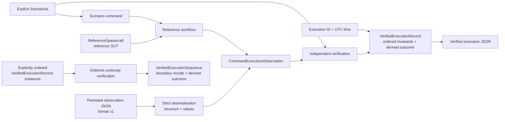

# OrbiRig

OrbiRig is a non-operational Python verification harness for simplified spacecraft operating-mode command workflows. It collects command-execution observations, evaluates them against explicit scenario expectations, and produces deterministic versioned JSON evidence, including verified execution records with derived `PASS` or `FAIL` outcomes.

The harness is the product. `ReferenceSpacecraft` is a deterministic, simplified spacecraft-behaviour test double and reference system under test (SUT): it supplies repeatable behaviour for the supported scenarios, but it is not the verification oracle.

**Core:** Python

**Verification:** pytest · Behave · Ruff · GitHub Actions

## Key capabilities

* execute three deterministic reference operating-mode scenarios and collect the command, pre-state, acknowledgement, post-state, and telemetry;
* verify observations independently against an explicitly selected `ScenarioId` using ordered invariants;
* distinguish expected command rejection from failed verification;
* verify operating-mode continuity across explicitly ordered verified execution records;
* serialise observations and verified execution records to deterministic versioned JSON;
* strictly deserialise observation evidence format version `1`, keeping structural and value validity separate from semantic verification.

## Verification flow



Fresh observations are collected around one command execution. Persisted version `1` observation JSON reaches the same `CommandExecutionObservation` model through a separate strict deserialisation boundary. In either path, the caller supplies the scenario expectation; it is never inferred from the observation.

## Verification boundaries

`ReferenceSpacecraft` provides deterministic reference behaviour, while the verifier evaluates observations independently. Successful observation-evidence deserialisation establishes only supported structural and value validity; it does not establish verification success.

Observation evidence does not store, infer, derive, or select a `ScenarioId`. A structurally valid observation, including one with an accepted acknowledgement, can still fail verification. Conversely, an expected command rejection passes when its rejection and preserved state satisfy the selected scenario expectations. Tests also submit inconsistent observations directly to the verifier, so verification is not validated only against output from the reference SUT.

## Supported reference scenarios

| Scenario | Pre-state | Command | Expected acknowledgement | Expected post-state |
| --- | --- | --- | --- | --- |
| `NOMINAL_TO_SAFE_MODE` | `NOMINAL` | `SET_OPERATING_MODE(SAFE)` | accepted | `SAFE` |
| `NOMINAL_TO_NOMINAL_REJECTION` | `NOMINAL` | `SET_OPERATING_MODE(NOMINAL)` | rejected | `NOMINAL` |
| `SAFE_TO_NOMINAL_MODE` | `SAFE` | `SET_OPERATING_MODE(NOMINAL)` | accepted | `NOMINAL` |

For accepted transitions, verification checks the expected pre-state, accepted acknowledgement, requested post-state, and telemetry consistency with the observed post-state. For the expected rejection, it checks the expected `NOMINAL` pre-state, rejected acknowledgement, state preservation, and telemetry consistency with the observed post-state. The same three workflows are represented as Behave scenarios; detailed negative cases, determinism, evidence behaviour, and deserialisation boundaries are covered in pytest.

## Ordered execution continuity

`verify_execution_sequence(...)` evaluates an explicitly ordered collection of at least two existing `VerifiedExecutionRecord` instances. For every adjacent pair, it compares the previous post-state operating mode with the next pre-state operating mode and retains both execution IDs, the expected and observed modes, and the boundary result.

Supplied order is authoritative: the verifier does not sort or infer order from timestamps, execution IDs, or scenarios. A sequence passes only when every member record already passes and every continuity boundary passes; member scenario invariants are not re-evaluated. The verifier is pure: it neither executes commands nor mutates a SUT.

## Execution evidence

OrbiRig has two serialised evidence representations.

### Observation evidence

Observation evidence records the command, pre-command state, acknowledgement, post-command state, and telemetry from one execution. `serialize_execution_evidence(...)` writes deterministic JSON using observation evidence format version `1`; `deserialize_execution_evidence(...)` strictly reconstructs a `CommandExecutionObservation` and rejects malformed JSON, unsupported versions, invalid shapes, missing or unexpected fields, incorrect primitive types, unknown modes, and unsupported command types.

Observation evidence contains neither `ScenarioId`, invariant results, nor a verification outcome. Its successful deserialisation therefore does not attest semantic verification.

### Verified execution records

`VerifiedExecutionRecord` combines an explicit execution ID, UTC execution time, selected `ScenarioId`, observation, ordered invariant results with expected and actual values, and a derived outcome. It passes only when every invariant passes.

`serialize_verified_execution_evidence(...)` writes deterministic JSON using verified-execution schema version `1`. Deserialisation of verified execution records is not implemented. Package versions and evidence/schema versions are independent version domains; one does not imply a change to the other.

Ordered sequence results are not serialised or persisted.

## Usage

### Execute and verify a reference workflow

```python
from datetime import datetime, timezone

from orbirig.evidence import serialize_verified_execution_evidence
from orbirig.execution import execute_verified_reference_workflow
from orbirig.models import ScenarioId
from orbirig.reference_sut import ReferenceSpacecraft

record = execute_verified_reference_workflow(
    spacecraft=ReferenceSpacecraft(),
    execution_id="example-001",
    executed_at=datetime(2026, 1, 1, tzinfo=timezone.utc),
    scenario_id=ScenarioId.NOMINAL_TO_SAFE_MODE,
)

print(serialize_verified_execution_evidence(record))
```

### Verify loaded observation evidence

```python
from datetime import datetime, timezone
from pathlib import Path

from orbirig.evidence import deserialize_execution_evidence
from orbirig.execution import build_verified_execution_record
from orbirig.models import ScenarioId

observation = deserialize_execution_evidence(
    Path("observation.json").read_text(encoding="utf-8"),
)

record = build_verified_execution_record(
    execution_id="loaded-001",
    executed_at=datetime(2026, 1, 1, tzinfo=timezone.utc),
    scenario_id=ScenarioId.NOMINAL_TO_SAFE_MODE,
    observation=observation,
)
```

The explicit `ScenarioId` supplied to `build_verified_execution_record(...)` selects the expectations for the loaded observation; it is not recovered or inferred from the loaded evidence.

## Local setup

OrbiRig targets Python 3.12. Create and activate a Python 3.12 virtual environment, then install the project with its test and development dependencies:

```bash
python -m pip install -e ".[test,dev]"
```

## Verification

Run the pytest suite:

```bash
python -m pytest -q
```

Run the Behave scenarios:

```bash
behave
```

Run the configured Ruff checks:

```bash
python -m ruff check .
```

GitHub Actions runs package-import checks, Ruff, pytest, and Behave on Python 3.12 for pull requests and pushes to `main`.

## Releases

Versioned release notes are available in [GitHub Releases](https://github.com/NikolayAir/OrbiRig/releases).

## Current scope

OrbiRig intentionally focuses on deterministic verification of simplified operating-mode workflows and independently inspectable execution evidence. It does not currently provide broader operational integration, persistence or replay, or user-facing reporting, and it does not claim standards compliance.

Verified-execution deserialisation and sequence serialisation are not currently implemented.

## Security

Report suspected vulnerabilities through GitHub Private Vulnerability Reporting rather than a public issue. See [SECURITY.md](SECURITY.md) for details.

## License

OrbiRig is available under the [MIT License](LICENSE).
