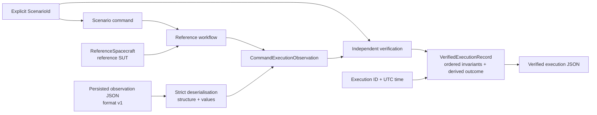

# OrbiRig

OrbiRig is a non-operational Python verification harness for simplified spacecraft operating-mode command workflows. It collects command execution observations, evaluates them against explicit scenario expectations, and produces deterministic versioned JSON evidence, including verified execution records with derived `PASS` or `FAIL` outcomes.

The verification harness is the product. `ReferenceSpacecraft` is a deterministic simplified spacecraft-behaviour test double that serves as the reference system under test (SUT); it supplies repeatable behaviour for the supported scenarios but does not define the expected verification result.

**Stack:** Python · pytest · Behave · Ruff · GitHub Actions

## Key capabilities

* execute three deterministic reference operating-mode scenarios and collect the command, pre-state, acknowledgement, post-state, and telemetry;
* verify observations independently against an explicitly selected `ScenarioId` using ordered invariants;
* distinguish expected command rejection from failed verification;
* verify operating-mode continuity across explicitly ordered verified execution records;
* serialise observations and verified execution records to deterministic versioned JSON;
* strictly deserialise observation evidence format version `1` while keeping structural and value validation separate from semantic verification.

## How it works



Fresh observations are collected by the reference workflow around one command execution. Persisted version `1` observation JSON reaches the same `CommandExecutionObservation` model through a separate strict deserialisation boundary.

In both paths, semantic verification uses an explicitly supplied scenario expectation rather than an expectation inferred from the observation.

## Verification boundaries

* `ReferenceSpacecraft` provides deterministic reference behaviour; it is not the verification oracle.
* `ScenarioId` remains external to execution observations. Observation evidence does not store, infer, derive, or select its own expected scenario.
* Successful observation-evidence deserialisation establishes supported structural and value validity only; it does not establish verification success.
* Expected command rejection can produce `PASS` when the rejection and preserved state match the selected scenario expectations. Structurally valid or accepted observations can still produce `FAIL`.
* Tests deliberately pass inconsistent observations to the verifier so verification behaviour is not validated only against observations produced by the reference SUT.

## Supported reference scenarios

The current implementation supports three deterministic operating-mode scenarios:

| Scenario                       | Pre-state | Command                       | Expected acknowledgement | Expected post-state |
| ------------------------------ | --------- | ----------------------------- | ------------------------ | ------------------- |
| `NOMINAL_TO_SAFE_MODE`         | `NOMINAL` | `SET_OPERATING_MODE(SAFE)`    | accepted                 | `SAFE`              |
| `NOMINAL_TO_NOMINAL_REJECTION` | `NOMINAL` | `SET_OPERATING_MODE(NOMINAL)` | rejected                 | `NOMINAL`           |
| `SAFE_TO_NOMINAL_MODE`         | `SAFE`    | `SET_OPERATING_MODE(NOMINAL)` | accepted                 | `NOMINAL`           |

For accepted transitions, the verifier checks the expected pre-state, accepted acknowledgement, requested post-state, and telemetry consistency with the observed post-state.

For the expected rejection, it checks the expected `NOMINAL` pre-state, rejected acknowledgement, preservation of the pre-command state, and telemetry consistency with the observed post-state.

The same three supported workflows are represented as Behave scenarios. Detailed invariant failures, negative cases, determinism, evidence behaviour, and deserialisation boundaries remain covered in pytest.

## Ordered execution continuity

`verify_execution_sequence(...)` evaluates an explicitly ordered collection of at least two existing `VerifiedExecutionRecord` instances. For each adjacent pair, it compares the previous post-state operating mode with the next pre-state operating mode and retains both execution IDs and the expected and observed modes.

The supplied order is authoritative: the verifier does not sort or infer order from timestamps, execution IDs, or scenarios. A sequence produces `PASS` only when every member record already has a `PASS` outcome and every continuity boundary passes. Member scenario invariants are not re-evaluated.

Sequence verification is pure and does not execute commands or mutate a SUT. Sequence results are not serialised or persisted, and the capability does not provide replay or transport integration.

## Execution evidence

OrbiRig currently uses two related evidence representations.

### Observation evidence

Observation evidence records only what was observed around one command execution:

* command type and requested operating mode;
* pre-command state;
* acknowledgement;
* post-command state;
* telemetry.

`serialize_execution_evidence(...)` writes this data as deterministic JSON using observation evidence format version `1`.

`deserialize_execution_evidence(...)` strictly reconstructs a `CommandExecutionObservation` from version `1` JSON. It rejects malformed JSON, unsupported versions, incorrect root or nested shapes, missing or unexpected fields, incorrect primitive types, unknown operating modes, and unsupported command types.

Observation evidence does not contain a `ScenarioId`, invariant results, or a verification outcome.

### Verified execution records

`VerifiedExecutionRecord` combines:

* an explicit execution ID;
* an explicit UTC execution time;
* the explicitly selected `ScenarioId`;
* the execution observation;
* ordered invariant results with expected and actual values;
* a derived `PASS` or `FAIL` outcome.

The outcome is `PASS` only when every invariant result passes.

`serialize_verified_execution_evidence(...)` writes the record as deterministic JSON using verified-execution schema version `1`. Deserialisation of `VerifiedExecutionRecord` is not currently implemented.

The package release version and evidence-format versions are separate version domains. Package version `0.3.0` continues to use observation evidence format version `1` and verified-execution schema version `1`; these versions do not advance automatically with the package version.

## Usage

### Execute and verify a reference workflow

```python
from datetime import datetime, timezone

from orbirig.evidence import serialize_verified_execution_evidence
from orbirig.execution import execute_verified_reference_workflow
from orbirig.models import ScenarioId
from orbirig.reference_sut import ReferenceSpacecraft

record = execute_verified_reference_workflow(
    spacecraft=ReferenceSpacecraft(),
    execution_id="example-001",
    executed_at=datetime(2026, 1, 1, tzinfo=timezone.utc),
    scenario_id=ScenarioId.NOMINAL_TO_SAFE_MODE,
)

print(serialize_verified_execution_evidence(record))
```

This executes the explicitly selected `NOMINAL_TO_SAFE_MODE` reference scenario, verifies the collected observation, derives the outcome, and serialises the resulting verified execution record.

### Verify loaded observation evidence

```python
from datetime import datetime, timezone
from pathlib import Path

from orbirig.evidence import deserialize_execution_evidence
from orbirig.execution import build_verified_execution_record
from orbirig.models import ScenarioId

observation = deserialize_execution_evidence(
    Path("observation.json").read_text(encoding="utf-8"),
)

record = build_verified_execution_record(
    execution_id="loaded-001",
    executed_at=datetime(2026, 1, 1, tzinfo=timezone.utc),
    scenario_id=ScenarioId.NOMINAL_TO_SAFE_MODE,
    observation=observation,
)
```

Deserialisation validates the persisted observation representation. The explicit `ScenarioId` supplied to `build_verified_execution_record(...)` determines which expectations are subsequently evaluated; it is not recovered or inferred from the loaded evidence.

## Run locally

OrbiRig currently targets Python 3.12.

Create and activate a Python 3.12 virtual environment, then install the project with its test and development dependencies:

```bash
python -m pip install -e ".[test,dev]"
```

## Checks

Run the pytest suite:

```bash
python -m pytest -q
```

Run the Behave scenarios:

```bash
behave
```

Run the configured Ruff checks:

```bash
python -m ruff check .
```

GitHub Actions runs package-import checks, Ruff, pytest, and the Behave scenarios on Python 3.12 for pull requests and pushes to `main`.

## Current limitations

The current implementation intentionally covers a narrow verification scope.

It does not provide:

* operational Ground Segment or mission-control functionality;
* spacecraft simulator or emulator functionality;
* ECSS, CCSDS, or other standards compliance;
* verification scenarios beyond the three supported operating-mode cases;
* deserialisation of `VerifiedExecutionRecord` or trust in persisted invariant results or outcomes;
* storage abstractions;
* execution replay;
* transport adapters or integration with external systems;
* reporting integrations or requirements traceability;
* a command-line or web interface;
* fault injection;
* flight-dynamics or orbital-mechanics modelling.

These capabilities should not be inferred from the implemented operating-mode verification and evidence workflows.

## Security

Report suspected vulnerabilities through GitHub Private Vulnerability Reporting rather than a public issue. See [SECURITY.md](SECURITY.md) for details.

## License

OrbiRig is available under the [MIT License](LICENSE).
