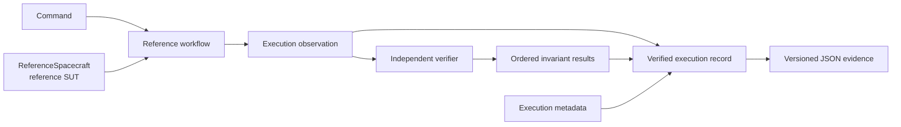

# OrbiRig

OrbiRig is a Python-first, non-operational verification harness for a simplified spacecraft command workflow. It runs a command against a deterministic spacecraft-behaviour test double, records what happened before and after the command, checks those observations independently, and produces project-versioned JSON evidence with a derived `PASS` or `FAIL` outcome.

The verification harness is the product. Its initial `ReferenceSpacecraft` implements the supported scenario and serves as the reference system under test (SUT). The scope is deliberately narrow so that command handling, observed state, telemetry, verification results, and evidence remain deterministic and directly testable.

## How it works



The reference workflow collects observations from `ReferenceSpacecraft`; it does not decide whether they are correct. Verification happens separately against the collected observation.

Tests can therefore pass deliberately inconsistent observations to the verifier instead of relying only on behaviour produced by the reference SUT.

## Current reference workflow

The current implementation covers one deterministic scenario:

`NOMINAL` → `SET_OPERATING_MODE(SAFE)` → `SAFE`

For each execution of the supported scenario, OrbiRig records:

* the command;
* the operating mode before the command;
* whether the command was acknowledged as accepted;
* the operating mode after the command;
* an operating-mode telemetry snapshot reported after execution.

The independent verifier then evaluates four ordered invariants—explicit consistency checks on those observations:

1. the pre-command state is `NOMINAL`;
2. the acknowledgement reports that the command was accepted;
3. the post-command state matches the requested operating mode;
4. the telemetry value matches the observed post-command state.

## Verified execution evidence

The primary evidence artefact is an immutable `VerifiedExecutionRecord`.

It contains:

* an explicit execution ID;
* an explicit UTC execution time;
* a scenario identifier derived from the supported command scenario;
* the collected execution observation;
* ordered invariant results with expected and actual values;
* a derived `PASS` or `FAIL` outcome.

The outcome is `PASS` only when every invariant result passes; otherwise it is `FAIL`.

Verified execution records can be serialised to deterministic, project-versioned JSON. The JSON contains the execution metadata, observation, invariant results, and derived outcome in a stable structure.

A separate lower-level serializer is also available for the execution observation alone. It records the command, state, acknowledgement, and telemetry data without the verified-execution metadata or invariant results.

## Example

```python
from datetime import datetime, timezone

from orbirig.evidence import serialize_verified_execution_evidence
from orbirig.execution import execute_verified_reference_workflow
from orbirig.reference_sut import ReferenceSpacecraft

record = execute_verified_reference_workflow(
    spacecraft=ReferenceSpacecraft(),
    execution_id="example-001",
    executed_at=datetime(2026, 1, 1, tzinfo=timezone.utc),
)

print(serialize_verified_execution_evidence(record))
```

This executes the supported reference scenario, verifies the resulting observation, derives the execution outcome, and serialises the resulting record as versioned JSON evidence.

## Development

OrbiRig currently targets Python 3.12.

Create and activate a Python 3.12 virtual environment, then install the project with its test and development dependencies:

```bash
python -m pip install -e ".[test,dev]"
```

Run the automated tests:

```bash
python -m pytest -q
```

Run the configured Ruff lint checks:

```bash
python -m ruff check .
```

GitHub Actions runs package-import checks, Ruff linting, and the pytest suite on Python 3.12 for pull requests and pushes to `main`.

## Current limitations

The current implementation intentionally covers a narrow verification scope.

It does not provide:

* operational Ground Segment or mission-control functionality;
* a spacecraft simulator or emulator;
* ECSS, CCSDS, or other standards compliance;
* rejected-command behaviour in the reference SUT;
* evidence loading or replay;
* transport adapters or integration with external systems;
* a command-line or web interface;
* BDD/Gherkin workflows, test reporting, or requirements traceability;
* fault injection;
* flight-dynamics or orbital-mechanics modelling.

These capabilities should not be inferred from the implemented command-to-telemetry verification flow.

## Security

Report suspected vulnerabilities through GitHub Private Vulnerability Reporting rather than a public issue. See [SECURITY.md](SECURITY.md) for details.

## License

OrbiRig is available under the [MIT License](LICENSE).
