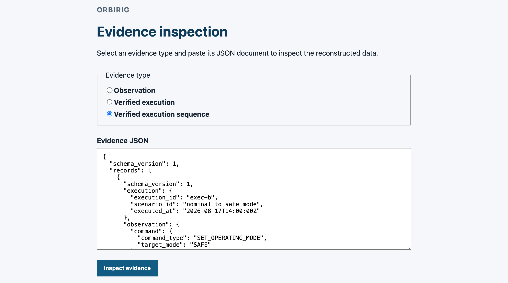
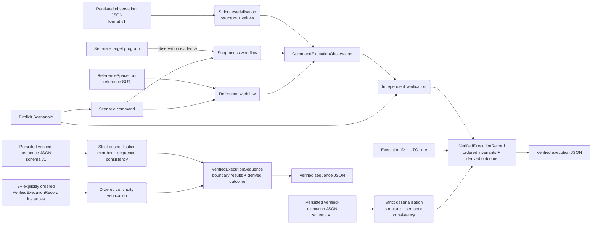

# OrbiRig

OrbiRig is a non-operational verification harness for simplified spacecraft operating-mode workflows. It collects command-execution observations and verifies them against explicit scenario expectations. The harness also checks continuity across ordered verified executions and represents observations, verified executions, and verified execution sequences as deterministic versioned JSON evidence.

`ReferenceSpacecraft` is a deterministic, simplified spacecraft-behaviour test double used as the reference system under test (SUT). It provides repeatable behaviour for the supported scenarios but is not the verification oracle.

**Core:** Python

**Web inspector:** FastAPI · React · TypeScript · Vite · [Live](https://orbirig-evidence-inspector.onrender.com/)

**Testing and CI:** pytest · Behave · Vitest · React Testing Library · Ruff · GitHub Actions

## Key capabilities

* execute three deterministic reference operating-mode scenarios and collect the command, pre-state, acknowledgement, post-state, and telemetry;
* collect observation evidence from a separate target program through a one-shot subprocess boundary;
* verify observations independently against an explicitly selected `ScenarioId`, distinguishing expected command rejection from failed verification;
* verify operating-mode continuity across explicitly ordered verified execution records;
* serialise observations, verified execution records, and verified sequences to deterministic versioned JSON;
* strictly reconstruct persisted evidence, separating observation validity from verification success and requiring stored derived results to match independently recomputed canonical results;
* inspect all three evidence forms through a read-only web interface while evidence deserialisation and verification semantics remain in the OrbiRig core.



## Verification flow



Fresh observations can come from the reference workflow or subprocess collection and capture one command execution. Persisted version `1` observation JSON reaches the same `CommandExecutionObservation` model through a separate strict deserialisation boundary. In all cases, the caller supplies the scenario expectation; it is never inferred from the observation.

## Verification boundaries

`ReferenceSpacecraft` provides deterministic reference behaviour, while verification remains independent of the reference SUT. Observation-evidence deserialisation establishes supported structural and value validity only; it neither selects a `ScenarioId` nor establishes verification success. The caller supplies the scenario expectation, and tests also submit intentionally inconsistent observations directly to the verifier.

Persisted derived results are treated as claims. Verified-execution deserialisation recomputes canonical invariant results and outcome; sequence deserialisation also reconstructs members canonically and recomputes continuity and the aggregate outcome in persisted order. Stored derived values must match exactly, so a canonically consistent `FAIL` record or sequence remains valid evidence.

Subprocess collection sends one compact command JSON document on stdin and requires stdout to contain exactly one valid observation-evidence document using the existing version `1` format. The collector treats launch failures, timeouts, non-zero exits, invalid UTF-8, invalid evidence, and returned-command mismatches as `ObservationCollectionError`. These failures prevent collection from producing a verified execution, so no invariant results or `VerifiedExecutionRecord` are constructed. `ExecutionOutcome.FAIL` remains reserved for successfully collected observations that violate verification expectations.

## Supported reference scenarios

| Scenario | Pre-state | Command | Expected acknowledgement | Expected post-state |
| --- | --- | --- | --- | --- |
| `NOMINAL_TO_SAFE_MODE` | `NOMINAL` | `SET_OPERATING_MODE(SAFE)` | accepted | `SAFE` |
| `NOMINAL_TO_NOMINAL_REJECTION` | `NOMINAL` | `SET_OPERATING_MODE(NOMINAL)` | rejected | `NOMINAL` |
| `SAFE_TO_NOMINAL_MODE` | `SAFE` | `SET_OPERATING_MODE(NOMINAL)` | accepted | `NOMINAL` |

For accepted transitions, verification checks the expected pre-state, accepted acknowledgement, requested post-state, and telemetry consistency with the observed post-state. For the expected rejection, it checks the expected `NOMINAL` pre-state, rejected acknowledgement, state preservation, and telemetry consistency.

## Ordered execution continuity

Ordered continuity verification detects cross-execution state discontinuities that individual verified records cannot.

`verify_execution_sequence(...)` evaluates at least two explicitly ordered `VerifiedExecutionRecord` instances. For each adjacent pair, it compares the previous post-state and next pre-state operating modes and retains both execution IDs, the expected and observed modes, and the boundary result.

Supplied order is authoritative: the verifier does not sort or infer order from timestamps, execution IDs, or scenarios. A sequence passes only if all member records and continuity boundaries pass; member scenario invariants are not re-evaluated. The verifier is pure: it neither executes commands nor mutates a SUT.

## Execution evidence

OrbiRig has three serialised evidence representations.

### Observation evidence

Observation evidence records the command, pre-state, acknowledgement, post-state, and telemetry from one execution. `serialize_execution_evidence(...)` writes deterministic JSON using format version `1`; `deserialize_execution_evidence(...)` strictly reconstructs a `CommandExecutionObservation` and rejects malformed JSON, duplicate object member names at any nesting level, unsupported versions, invalid shapes, missing or unexpected fields, incorrect primitive types, unknown modes, and unsupported command types.

Observation evidence contains neither `ScenarioId`, invariant results, nor a verification outcome. Its successful deserialisation therefore does not attest semantic verification.

### Verified execution records

`VerifiedExecutionRecord` combines an explicit execution ID, UTC execution time, selected `ScenarioId`, observation, ordered invariant results with expected and actual values, and a derived outcome. It passes only when all invariants pass.

`serialize_verified_execution_evidence(...)` writes deterministic JSON using verified-execution schema version `1`. `deserialize_verified_execution_evidence(...)` strictly reconstructs a record by independently deriving its canonical invariant results and outcome from the persisted scenario and observation, then requiring the stored derived values to match exactly. A canonically consistent `FAIL` record remains valid evidence. Package and evidence/schema versions are independent; changing one does not imply changing the other.

### Verified execution sequences

`serialize_verified_execution_sequence_evidence(...)` writes an ordered `VerifiedExecutionSequence` using verified-execution-sequence schema version `1`. Each member is stored as complete nested verified-execution data, followed by every ordered continuity result and the aggregate outcome.

`deserialize_verified_execution_sequence_evidence(...)` strictly reconstructs each member through the verified-execution evidence semantics, then recomputes continuity in persisted order. Persisted boundaries and the aggregate outcome must exactly match the canonical sequence result. Duplicate execution IDs and equal or non-monotonic timestamps remain valid; neither determines sequence order.

## Usage

### Execute and verify a reference workflow

```python
from datetime import datetime, timezone

from orbirig.evidence import serialize_verified_execution_evidence
from orbirig.execution import execute_verified_reference_workflow
from orbirig.models import ScenarioId
from orbirig.reference_sut import ReferenceSpacecraft

record = execute_verified_reference_workflow(
    spacecraft=ReferenceSpacecraft(),
    execution_id="example-001",
    executed_at=datetime(2026, 1, 1, tzinfo=timezone.utc),
    scenario_id=ScenarioId.NOMINAL_TO_SAFE_MODE,
)

print(serialize_verified_execution_evidence(record))
```

### Verify loaded observation evidence

```python
from datetime import datetime, timezone
from pathlib import Path

from orbirig.evidence import deserialize_execution_evidence
from orbirig.execution import build_verified_execution_record
from orbirig.models import ScenarioId

observation = deserialize_execution_evidence(
    Path("observation.json").read_text(encoding="utf-8"),
)

record = build_verified_execution_record(
    execution_id="loaded-001",
    executed_at=datetime(2026, 1, 1, tzinfo=timezone.utc),
    scenario_id=ScenarioId.NOMINAL_TO_SAFE_MODE,
    observation=observation,
)
```

The explicit `ScenarioId` supplied to `build_verified_execution_record(...)` selects the expectations for the loaded observation; it is not recovered or inferred from the loaded evidence.

### Execute and verify a subprocess workflow

```python
from datetime import datetime, timezone

from orbirig.execution import execute_verified_subprocess_workflow

record = execute_verified_subprocess_workflow(
    argv=["/path/to/observation-peer"],
    timeout=5.0,
    execution_id="external-001",
    executed_at=datetime(2026, 1, 1, tzinfo=timezone.utc),
)
```

The target receives `{"command_type":"SET_OPERATING_MODE","target_mode":"SAFE"}` followed by one newline for the default scenario. It must exit successfully and write exactly one valid observation-evidence version `1` document to stdout. A successfully collected observation then follows the same canonical verification path as directly loaded or reference-workflow observations, so its result may be either `PASS` or `FAIL`.

### Inspect evidence in the web interface

Install the web and frontend dependencies:

```bash
python -m pip install -e ".[web]"
cd frontend
npm ci
cd ..
```

For local development, start FastAPI and Vite in separate terminals:

```bash
uvicorn orbirig.web:app --reload
```

```bash
cd frontend
npm run dev
```

During local development, Vite proxies inspection requests to FastAPI. The frontend submits the textarea value unchanged as a `text/plain; charset=utf-8` request body; FastAPI decodes it and delegates directly to the corresponding strict evidence deserialiser. The browser does not parse, validate, or verify submitted evidence.

To serve the built interface through FastAPI, build the frontend before starting the application:

```bash
cd frontend
npm run build
cd ..
uvicorn orbirig.web:app
```

Observation inspection renders reconstructed fields only. Verified-execution inspection adds execution metadata, explicit `ScenarioId`, canonical invariant results, and the derived outcome; sequence inspection adds the aggregate outcome, ordered member records, and continuity boundaries. Canonically consistent `FAIL` records and sequences remain valid evidence.

### Reconstruct persisted verified evidence

```python
from pathlib import Path

from orbirig.evidence import (
    deserialize_verified_execution_evidence,
    deserialize_verified_execution_sequence_evidence,
)

record = deserialize_verified_execution_evidence(
    Path("verified-execution.json").read_text(encoding="utf-8"),
)

sequence = deserialize_verified_execution_sequence_evidence(
    Path("verified-sequence.json").read_text(encoding="utf-8"),
)
```

Both readers return reconstructed models only when persisted derived values match OrbiRig's independently recomputed canonical verification semantics.

## Local setup

OrbiRig currently requires Python 3.12. Create and activate a Python 3.12 virtual environment, then install the project with its test, development, and web dependencies:

```bash
python -m pip install -e ".[test,dev,web]"
```

## Verification

Run the Python checks:

```bash
python -m pytest -q
behave
python -m ruff check .
```

Behave covers the three supported reference workflows; detailed negative cases, determinism, evidence behaviour, and deserialisation boundaries are covered in pytest.

GitHub Actions runs package-import checks, Ruff, pytest, and Behave for the Python package, plus frontend type checking, tests, a production build, and a FastAPI serving smoke check on pull requests and pushes to `main`.

## Releases

Versioned release notes are available in [GitHub Releases](https://github.com/NikolayAir/OrbiRig/releases).

## Current scope

OrbiRig intentionally focuses on deterministic verification of simplified operating-mode workflows and independently inspectable execution evidence. Its read-only interface currently supports observation, verified-execution, and verified-execution-sequence evidence. External execution is limited to one command and one observation per subprocess invocation; HTTP execution, storage, replay, and report generation remain unsupported. OrbiRig does not claim compliance with any specific space-industry standard.

## Security

Report suspected vulnerabilities privately through GitHub Private Vulnerability Reporting; see [SECURITY.md](SECURITY.md).

## License

OrbiRig is available under the [MIT License](LICENSE).
