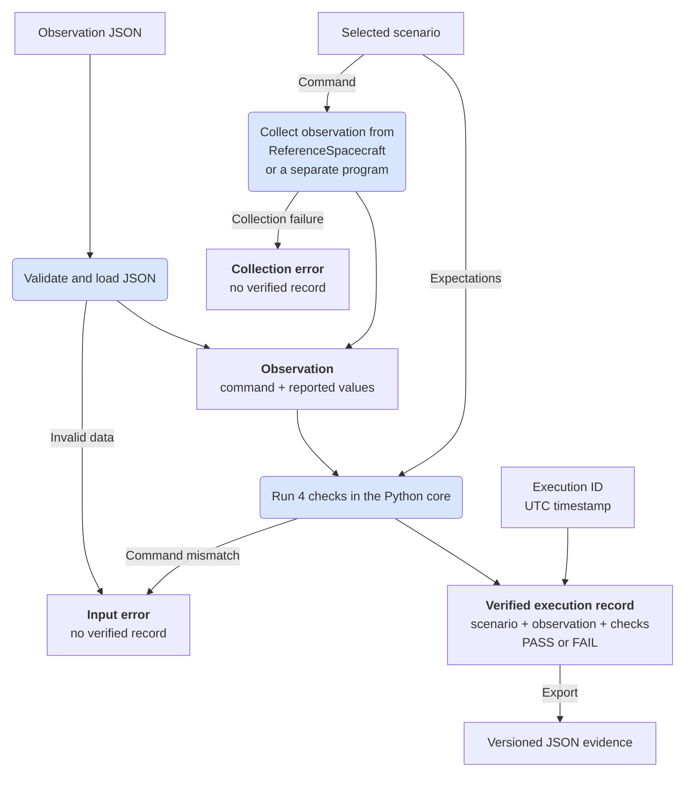

# Architecture

The Python core owns the scenario rules, JSON validation and verification results. The command line calls it directly. The React/TypeScript interface submits recorded data to the FastAPI adapter and displays its response. You can use the core on its own as a Python library.

## Verification flow

The [verification overview in the README](../README.md#how-verification-works) introduces the four checks. The detailed diagram here follows an observation from a JSON file or a command run to a verified record or an error. In both paths, the caller selects the scenario and provides the execution ID and UTC time.

```mermaid
---
config:
  layout: dagre
  look: classic
  flowchart:
    diagramPadding: 16
    wrappingWidth: 280
---
flowchart TD
    accTitle: Observation collection and independent verification
    accDescr: The Python core loads an observation from JSON or collects one by executing the selected scenario's command. It compares the observation with the scenario's expectations. A verified record stores the execution ID, UTC time, four checks and a PASS or FAIL outcome. An input error or a collection error stops verification before it creates a record.
    saved["Observation JSON"] ---> load("Validate and load JSON")
    scenario["Selected scenario"] -->|Command| collect("Collect observation from<br/>ReferenceSpacecraft<br/>or a separate program")
    collect ---> observation
    load --> observation["<b>Observation</b><br/>command + reported values"]
    scenario -->|Expectations| verifier("Run 4 checks in the Python core")
    observation --> verifier
    verifier -->|Command mismatch| error["<b>Input error</b><br/>no verified record"]
    load -->|Invalid data| error
    collect -->|Collection failure| collectionError["<b>Collection error</b><br/>no verified record"]
    metadata["Execution ID<br/>UTC timestamp"] --> record["<b>Verified execution record</b><br/>scenario + observation + checks<br/>PASS or FAIL"]
    verifier --> record
    record -->|Export| evidence["Versioned JSON evidence"]
    classDef action fill:#3b82f633
    class load,collect,verifier action
```

An invalid execution ID or timestamp also prevents record creation. Both [Python execution helpers](python.md) validate the metadata and scenario before they handle a reference command or start a target. The [subprocess helper](python.md#collect-from-a-separate-program) also validates its timeout before launch.

The Python API builds reference observations directly from `ReferenceSpacecraft` state, acknowledgement and telemetry. For subprocesses, collection validates the returned JSON with the same reader used for saved observations; invalid output follows the collection-error path.

A [collection or verification error](verification.md#collection-and-verification) leaves the external target's state unknown. A completed verification can report `FAIL` using a valid observation.

## Component responsibilities

| Component | Responsibility |
| --- | --- |
| [Models](../src/orbirig/models.py) | Define the supported scenarios, commands, observations, execution metadata and result structures. |
| [Verification](../src/orbirig/verification.py) | Compare observations with explicit scenario expectations and check continuity between adjacent records without changing their order. |
| [Command execution and observation collection](../src/orbirig/execution.py) | Select the scenario's command, collect its observation from [ReferenceSpacecraft](../src/orbirig/reference_sut.py) or a [separate program](../src/orbirig/subprocess_collection.py), then request verification. |
| [Evidence JSON](../src/orbirig/evidence.py) | Validate JSON structures and values, reconstruct and compare derived results before serialising verified evidence, and recompute checks and outcomes when reopening it. |
| [Strict JSON reader](../src/orbirig/_strict_json.py) | Read evidence documents and the HTTP request wrapper. Reject repeated field names, malformed JSON, excessive nesting and integers exceeding Python's configured digit limit. |
| [Command line](../src/orbirig/cli.py) and [HTTP API](../src/orbirig/web.py) | Read input, call the Python core and return results or errors. These interfaces check recorded data without executing spacecraft commands. |
| [Browser interface](../frontend/src/App.tsx) | Submit observations or saved evidence to the HTTP API and display results, request errors and cancellation status. |

[`ReferenceSpacecraft`](../src/orbirig/reference_sut.py) is a simplified, deterministic test double used to produce repeatable observations. The verifier defines expectations independently of this test double.

The [evidence format reference](evidence-formats.md) lists the stored fields, their order and the rules for comparing saved and recalculated results.

### Browser modules

[`App.tsx`](../frontend/src/App.tsx) owns navigation and form inputs. It also keeps both request hooks mounted while only the selected panel is displayed. Switching between verification and inspection therefore retains inputs, results and pending requests.

| Module | Responsibility |
| --- | --- |
| [Verification panel](../frontend/src/VerificationPanel.tsx) and [inspection panel](../frontend/src/InspectionPanel.tsx) | Render inputs, actions and feedback from the state passed by `App`. |
| [API client](../frontend/src/apiClient.ts) and [response checks](../frontend/src/apiResponses.ts) | Send the original evidence text and check HTTP responses for the fields the interface needs. A complete response has four checks per execution. A sequence has at least two records and one continuity result per adjacent pair. Incomplete responses produce a request error. Python calculates the verification results. |
| [Request tracking](../frontend/src/useCancellableRequest.ts) | Track verification and inspection separately. Abort browser requests on cancellation or when React removes the application from the page, and ignore late responses after cancellation or retry, including after JSON parsing. |
| [Completion feedback](../frontend/src/useWorkflowFeedback.ts) | Coordinate announcements, focus and scrolling, giving up automatic focus when the user moves elsewhere. |
| [Evidence details](../frontend/src/EvidenceDetails.tsx) | Display observations, verification checks and sequence records in the order returned by Python. |
| [Field help](../frontend/src/FieldHelp.tsx) and [help state](../frontend/src/useVerificationFieldHelp.ts) | Share the field-tooltip markup and manage deliberate opening, dismissal and a single pinned tooltip. |
